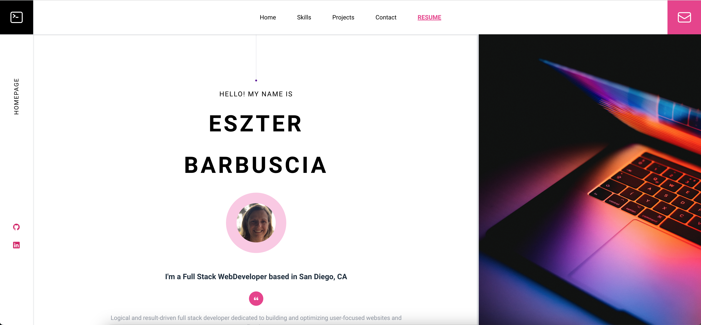

# My React Portfolio

  
  # [EszterBarbuscia.com](https://eszterbarbuscia.com/)
    
  <a href=""></a>
  <a href=""></a>
  <a href=""> </a>
  
  

  
## User Story

AS A newly graduated student, I WANT to be able to promote my work and resume, SO THAT I can land a job

## Description 
Learn more about me, see my latest projects, and download my resume with work and education experiences. 

I want to hear from you! Send me a message via the contact form or email me at eszterbarbuscia@gmail.com. 

## Table of Contents
* [Installation](#installation)
* [License](#license)
* [Contributing](#contributing)
* [Tests](#tests)
* [Questions](#questions)
* [Contributors](#contributors)
  
## Installation 

* Start server with command `npm run dev`.

## License
This project is covered under the MIT licence.  
To learn more click on the following *[link](https://opensource.org/licenses/MIT)*

## How to Contribute 
Please follow Contributor Covenant Guidelines by clicking on the following link: 
*[Contributor Covenant](https://www.contributor-covenant.org/)*

## Tests
No tests, just start the server and run the app 

## Questions
Please visit [GitHub Repo](https://github.com/Esztergb/portfolio) to view this project.
[Deployed Page](https://sweet-raindrop-b2daf8.netlify.app/)

##  Credits
Thank you for tips and sugestions from Bootcamp instructors and classmates. I have used the following tutorials 

https://www.freecodecamp.org/news/build-portfolio-website-react/

https://tailwindcss.com/docs/installation

https://www.youtube.com/watch?v=DGKjcLzX8Jw

https://www.youtube.com/watch?v=Ul3y1LXxzdU&t=442s

https://www.stackoverflow.com 

Some codes were based on mini project and some other modules from bootcamp. 

## Contributors

Eszter Barbuscia 

